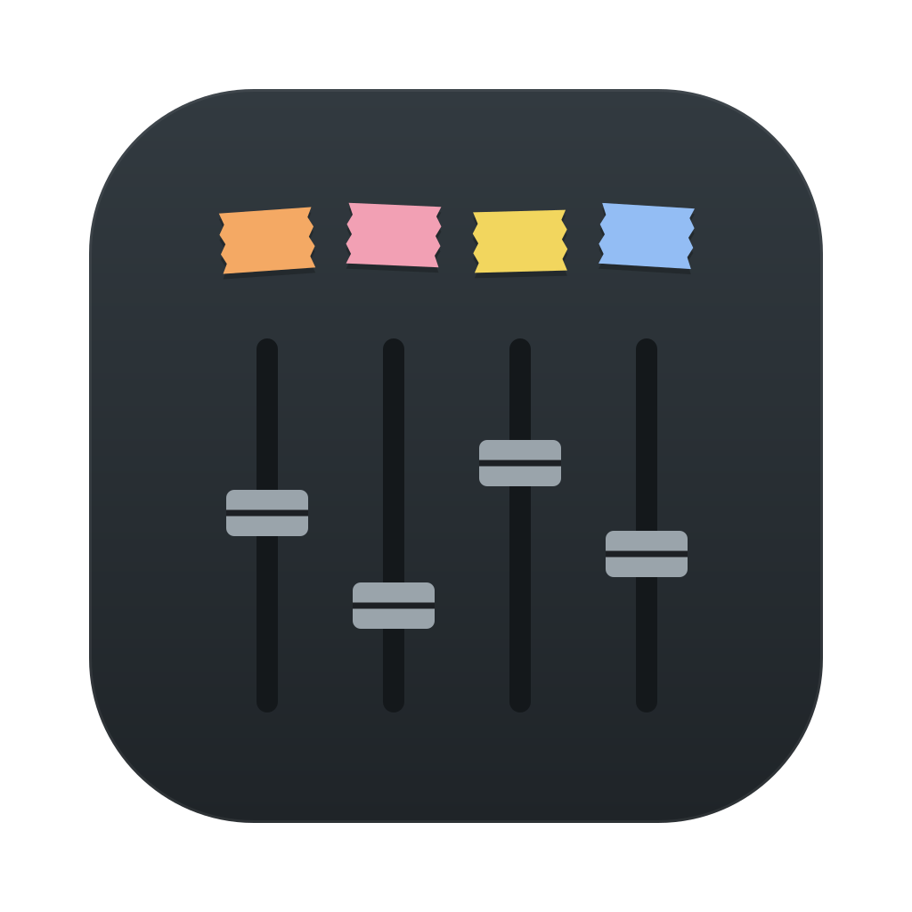

# DJI Controller

A native macOS mixer for the DJI Mic Mini 2S. Plug the receiver into your Mac and control every transmitter from one window: gain, mute, levels, names, recording, and separate feeds for your stream and the venue's PA.

Built for running live event streams and podcasts with up to four wireless mics.

> Not affiliated with or endorsed by DJI. It talks to the receiver over the same USB channel the DJI Mimo app uses through the phone adapter.

## What it does

- **Four channel strips**, one per transmitter, with a live meter, fader, mute and battery status.
- **Mute with keys 1 to 4.** Mutes are instant and click-free.
- **Hardware gain** on each transmitter (-12 to +12 dB), confirmed by the receiver.
- **Names and tape colours** per mic, so you know who is wearing which one.
- **4-track recording**: one WAV per mic (recorded before mute and fader, so a cough-mute never loses material) plus a stereo mix. Optional backup recording on the transmitters themselves.
- **Stream output** through a built-in virtual mic called "DJI Controller" that Streamlabs, OBS or any other app can select.
- **Venue output** to any wired output, with its own level and per-mic sends. It adds about 6 to 8 ms on top of the wireless link.
- **Receiver settings**: mono, stereo or 4-track mode, noise cancellation and low cut.

## Requirements

- macOS 15 or later
- Xcode 16 or later and [XcodeGen](https://github.com/yonaskolb/XcodeGen) (`brew install xcodegen`)
- A DJI Mic Mini 2S receiver (USB ID `2ca3:4015`, or `2ca3:4115` in 4-track mode) with Mini 2S transmitters

## Build and run

```sh
xcodegen generate
xcodebuild -project DJIController.xcodeproj -scheme DJIController -configuration Release -derivedDataPath build build
open build/Build/Products/Release/DJIController.app
```

Builds are ad-hoc signed by default. To sign with your own Apple Development identity, which keeps the microphone permission across rebuilds, create `Config/Local.xcconfig`:

```
DEVELOPMENT_TEAM = YOURTEAMID
CODE_SIGN_IDENTITY = Apple Development
```

Run the tests with `xcodebuild -project DJIController.xcodeproj -scheme DJIController test`.

## First run

1. Allow microphone access when macOS asks. The app needs it to read the receiver's audio.
2. Switch the receiver to **4-track** (the banner offers it). Each mic then arrives on its own channel. The receiver restarts for a few seconds.
3. On the **Stream** strip, click **Set up** to install the virtual mic. macOS asks for your password once, because audio drivers live in `/Library/Audio/Plug-Ins/HAL`. Then pick **DJI Controller** as the mic in your streaming app.
4. Pick a wired output on the **Venue** strip if you feed a PA.

## How it works

- **Control:** the receiver exposes a vendor USB interface (`com.dji.mic`, interface 4). Selecting alternate setting 1 opens two bulk endpoints that carry DJI's DUML protocol: status pushes for the receiver and each transmitter, and set-parameter commands. See `App/Device`.
- **Audio:** the app builds a private aggregate device with the receiver as clock master and the outputs drift-compensated, so mixing happens in one small-buffer CoreAudio callback. The mixer core is lock-free C (`App/Audio/AudioCore.c`).
- **Recording:** the audio callback writes into a lock-free ring buffer that a background thread drains to disk.
- **Stream device:** a virtual audio driver built from [BlackHole](https://github.com/ExistentialAudio/BlackHole), customised through `Driver/StreamDriverConfig.h` without editing its source.

`tools/` holds the Python and Swift scripts used to reverse-engineer the receiver, plus `djictl`, which drives a debug build from the shell.

## Contributing

Bug reports and pull requests are welcome. See [CONTRIBUTING.md](CONTRIBUTING.md) for setup, testing with a receiver and the protocol safety rules. Please report security issues privately as described in [SECURITY.md](SECURITY.md).

## Credits

- [usokawa/dji-mic-mo](https://github.com/usokawa/dji-mic-mo) documented the Mic Mini parameter IDs and status offsets this app builds on.
- [ShadowBitBasher/DJI-Mic-Control](https://github.com/ShadowBitBasher/DJI-Mic-Control) documented the protocol for earlier receivers.
- [BlackHole](https://github.com/ExistentialAudio/BlackHole) by Existential Audio powers the stream device. It is GPL-3.0 licensed; the vendored copy and its license are in `Vendor/BlackHole`.

## License

DJI Controller is free software, licensed under the [GNU General Public License v3.0](LICENSE). Copyright (C) 2026 the DJI Controller authors.

The GPL is what allows the app to bundle BlackHole: BlackHole may be used in apps that are themselves GPL-3.0. A version under any other license would need a commercial license from [Existential Audio](https://existential.audio) or a different virtual audio driver.
